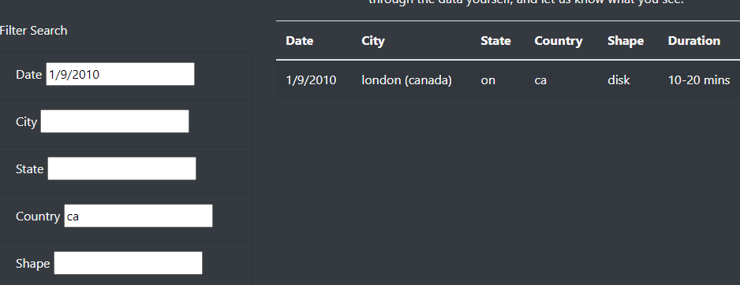

# Web-driven UFO Sighting Search Engine

## Project Overview
The intent of this project is to construct a searchable web-based front-end for a collection of reported UFO sightings for public consumption and analysis.

## Resources
* JavaScript
    * D3
* HTML
* CSS
* Bootstrap
* Google Chrome + dev tools
* VS Code

## Data
Dataset comprised of listed worldwide sightings in the first weeks of January 2010.  Data is captured in JSON format (see `/js/data.js`).  Data contains basic geographic information of the sighting, duration, shape, and overall commentary from the reporter of the sighting.

## Summary of website
Website launches with all values in the data set, but allows for filtering based on the following criteria:
* Date
* City
* State
* Country
* Shape of UFO

Website dynamically narrows down data set based on text input, and will display all results that match every input item used, as indicated in the image below:

Deleting the filter values will return the full data set again.

## Drawbacks and areas for improvement
* Search does not support multiple list-style selects (ex: California OR Arizona).
* Search does not support date ranges, only allowing for one speific date at a time.
* Search requires complete rather than partial strings for all text-based entry fields, so searching "San" in city would return no values, rather than "San Jose", "San Diego", "San Francisco", etc. Next build should switch from an equivalence lookup to a substring lookup for ease of use.
* Text formatting contains ASCII artifacts and other legibility issues that could be procedurally cleaned up prior to data display (ex: "`Orange spheres in sky New Year&#39s Eve&#44 San Diego&#44 CA`").